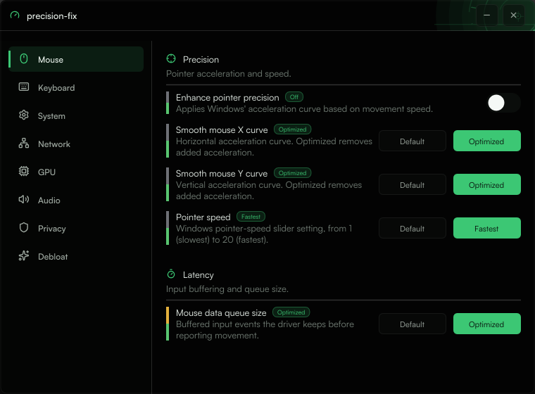

# precision-fix

Windows desktop app (ImGui + DirectX 11) for tuning system performance and responsiveness through registry and OS-level tweaks. Each toggle applies a real setting, not a scripted preset — changes are read from and written directly to the system.



## Gain / impact indicator

Every setting row shows two small colored bars:

- **Gain** — expected performance/responsiveness benefit of enabling the tweak.
- **Impact** — how much it changes default system behavior (stability, compatibility, or feature loss).

Hovering a row shows both levels (Low / Medium / High) as a tooltip, so a change can be judged before it's applied.

## App features

- **Info** — theme (dark/light), language (English / Español / Português-Brasil), about and GitHub link.
- **Logs** — in-memory runtime log of feature changes and errors (cleared on exit).
- **Auto-update check** — on startup, notifies when a newer GitHub release is available.

## Modules

- **Mouse** — pointer precision (mouse acceleration), sensor smoothing curves, input data queue size, pointer speed.
- **Keyboard** — Filter Keys, Sticky Keys, Toggle Keys, Mouse Keys, key repeat delay/rate, USB selective suspend (per-device and global), input data queue size.
- **System** — CPU priority separation, system responsiveness, network throttling index, Games MMCSS profile, Game Mode, prefetch, power throttling, timer coalescing, processor idle states, Intel TSX, foreground lock timeout, menu show delay, UI animations, file extensions visibility, dark mode, hibernation, fast startup, sleep diagnostics, energy estimation, modern standby, SvcHost split threshold, last-access timestamps, 8.3 filename creation, restore point frequency, system-managed page file, toast notifications, fast app termination, Windows Search indexing, SysMain, background apps, Delivery Optimization.
- **Network** — Nagle's algorithm, active probing, fast DNS, wide ephemeral port range, fast port recycling, Linux-like TTL, fast name resolution, IPv6 disable, NIC power saving, Wake-on-LAN, NIC offload tuning, TCP auto-tuning, ECN, CTCP congestion provider, TCP timestamps, global RSS, DNS over HTTPS, QoS bandwidth reserve.
- **GPU** — GPU preemption, HDCP, hardware-accelerated GPU scheduling, NVIDIA preemption override, AMD power gating disable, graphics latency tolerance, multi-plane overlays (MPO).
- **Audio** — audio enhancements toggle, exclusive mode.
- **Privacy** — telemetry, advertising ID, activity feed, tailored experiences, Game DVR, content suggestions, error reporting, diagnostic execution, location services, feedback prompts, News and Interests, Windows feeds, setting sync, diagnostic tasks.
- **Debloat** — removal of preinstalled Windows apps (Weather, Get Help, Get Started, 3D Viewer, Messaging, Solitaire Collection, Sticky Notes, Mixed Reality Portal, People, Print 3D, Skype, Alarms, Camera, Feedback Hub, Maps, Sound Recorder, Your Phone, Zune Music, Mail and Calendar, Bing apps, Drawboard PDF, Sway, Cortana, Copilot, and more).

## Build

Windows, Visual Studio 2026 (v145 toolset), vcpkg manifest mode (ImGui with Win32 + DX11 bindings).

```
msbuild precision-fix.slnx /p:Configuration=Release /p:Platform=x64
```

Output: `Build/x64 - Release/App.exe`.
